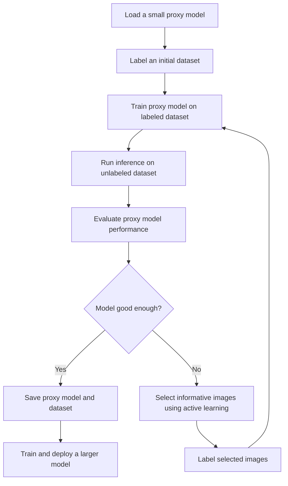
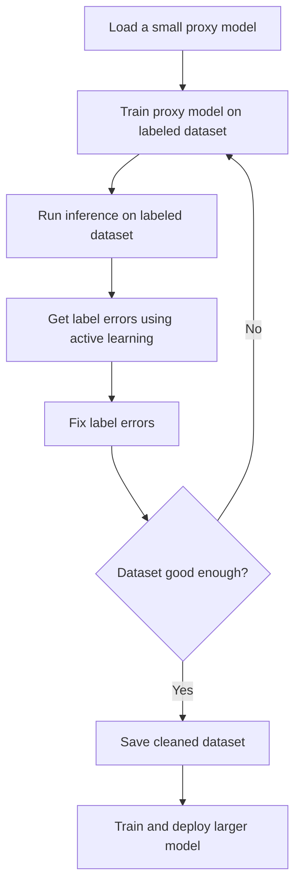

[](https://pypi.org/project/active-vision/)
   

<p align="center">
  
</p>

The goal of this project is to create a framework for the active learning loop for computer vision. The diagram below shows a general workflow of how the active learning loop works.

<p align="center">
  
</p>

### Supported tasks:
- [X] Image classification
- [ ] Object detection
- [ ] Segmentation

### Supported models:
- [X] Fastai models
- [X] Torchvision models
- [X] Timm models
- [ ] Hugging Face models

### Supported Active Learning Strategies:

Uncertainty Sampling:
- [X] Least confidence
- [ ] Margin of confidence
- [ ] Ratio of confidence
- [ ] Entropy

Diverse Sampling:
- [X] Random sampling
- [ ] Model-based outlier
- [ ] Cluster-based
- [ ] Representative

## 📦 Installation

Get a release from PyPI
```bash
pip install active-vision
```

Install from source
```bash
git clone https://github.com/dnth/active-vision.git
cd active-vision
pip install -e .
```

I recommend using [uv](https://docs.astral.sh/uv/) to set up a virtual environment and install the package. You can also use other virtual env of your choice.

If you're using uv:

```bash
uv venv
uv sync
```
Once the virtual environment is created, you can install the package using pip.

> [!TIP]
> If you're using uv add a `uv` before the pip install command to install into your virtual environment. Eg:
> ```bash
> uv pip install active-vision
> ```

## 🛠️ Usage
See the [notebook](./nbs/04_relabel_loop.ipynb) for a complete example.

Be sure to prepared 3 subsets of the dataset:
- [Initial samples](./nbs/initial_samples.parquet): A dataframe of a labeled images to train an initial model. If you don't have any labeled data, you can label some images yourself.
- [Unlabeled samples](./nbs/unlabeled_samples.parquet): A dataframe of *unlabeled* images. We will continuously sample from this set using active learning strategies.
- [Evaluation samples](./nbs/evaluation_samples.parquet): A dataframe of *labeled* images. We will use this set to evaluate the performance of the model. This is the test set, DO NOT use it for active learning. Split this out in the beginning.

As a toy example I created the above 3 datasets from the imagenette dataset.

```python
from active_vision import ActiveLearner
import pandas as pd

# Create an active learner instance with a model
al = ActiveLearner("resnet18")

# Load dataset 
train_df = pd.read_parquet("training_samples.parquet")
al.load_dataset(df, filepath_col="filepath", label_col="label")

# Train model
al.train(epochs=3, lr=1e-3)

# Evaluate the model on a *labeled* evaluation set
accuracy = al.evaluate(eval_df, filepath_col="filepath", label_col="label")

# Get predictions from an *unlabeled* set
pred_df = al.predict(filepaths)

# Sample low confidence predictions from unlabeled set
uncertain_df = al.sample_uncertain(pred_df, num_samples=10)

# Launch a Gradio UI to label the low confidence samples
al.label(uncertain_df, output_filename="uncertain")
```


Once complete, the labeled samples will be save into a new df.
We can now add the newly labeled data to the training set.

```python
# Add newly labeled data to training set and save as a new file active_labeled
al.add_to_train_set(labeled_df, output_filename="active_labeled")
```

Repeat the process until the model is good enough. Use the dataset to train a larger model and deploy.

> [!TIP]
> For the toy dataset, I got to about 93% accuracy on the evaluation set with 200+ labeled images. The best performing model on the [leaderboard](https://github.com/fastai/imagenette) got 95.11% accuracy training on all 9469 labeled images.
> 
> This took me about 6 iterations of relabeling. Each iteration took about 5 minutes to complete including labeling and model training (resnet18). See the [notebook](./nbs/04_relabel_loop.ipynb) for more details.
>
> But using the dataset of 200+ images, I trained a more capable model (convnext_small_in22k) and got 99.3% accuracy on the evaluation set. See the [notebook](./nbs/05_retrain_larger.ipynb) for more details.


## 📊 Benchmarks
This section contains the benchmarks I ran using the active learning loop on various datasets.

Column description:
- `#Labeled Images`: The number of labeled images used to train the model.
- `Evaluation Accuracy`: The accuracy of the model on the evaluation set.
- `Train Epochs`: The number of epochs used to train the model.
- `Model`: The model used to train.
- `Active Learning`: Whether active learning was used to train the model.
- `Source`: The source of the results.

### Imagenette
- num classes: 10
- num images: 9469

To start the active learning loop, I labeled 100 images (10 images from each class) and iteratively relabeled the most informative images until I hit 275 labeled images. 

The active learning loop is a iterative process and can keep going until you hit a stopping point. You can decide your own stopping point based on your use case. It could be:
- You ran out of data to label.
- You hit a performance goal.
- You hit a budget.
- Other criteria.

For this dataset,I decided to stop the active learning loop at 275 labeled images because the performance on the evaluation set is close to the top performing model on the leaderboard. 


| #Labeled Images | Evaluation Accuracy | Train Epochs | Model                | Active Learning | Source |
|-----------------|---------------------|--------------|----------------------|----------------|--------|
| 9469            | 94.90%              | 80           | xse_resnext50        | ❌             | [Link](https://github.com/fastai/imagenette) |
| 9469            | 95.11%              | 200          | xse_resnext50        | ❌             | [Link](https://github.com/fastai/imagenette) |
| 275             | 99.33%               | 6            | convnext_small_in22k | ✓              | [Link](https://github.com/dnth/active-vision/blob/main/nbs/05_retrain_larger.ipynb) |
| 275             | 93.40%               | 4            | resnet18             | ✓              | [Link](https://github.com/dnth/active-vision/blob/main/nbs/04_relabel_loop.ipynb) |

### Dog Food
- num classes: 2
- num images: 2100

To start the active learning loop, I labeled 20 images (10 images from each class) and iteratively relabeled the most informative images until I hit 160 labeled images. 

I decided to stop the active learning loop at 160 labeled images because the performance on the evaluation set is close to the top performing model on the leaderboard. You can decide your own stopping point based on your use case.

| #Labeled Images | Evaluation Accuracy | Train Epochs | Model | Active Learning | Source |
|-----------------|---------------------|--------------|-------|----------------|--------|
| 2100            | 99.70%              | ?            | vit-base-patch16-224   | ❌             | [Link](https://huggingface.co/abhishek/autotrain-dog-vs-food) |
| 160             | 100.00%             | 6            | convnext_small_in22k   | ✓              | [Link](https://github.com/dnth/active-vision/blob/main/nbs/dog_food_dataset/02_train.ipynb) |
| 160             | 97.60%              | 4            | resnet18              | ✓              | [Link](https://github.com/dnth/active-vision/blob/main/nbs/dog_food_dataset/01_label.ipynb) |

### Oxford-IIIT Pet
- num classes: 37
- num images: 3680

To start the active learning loop, I labeled 370 images (10 images from each class) and iteratively relabeled the most informative images until I hit 612 labeled images. 

I decided to stop the active learning loop at 612 labeled images because the performance on the evaluation set is close to the top performing model on the leaderboard. You can decide your own stopping point based on your use case.

| #Labeled Images | Evaluation Accuracy | Train Epochs | Model | Active Learning | Source |
|-----------------|---------------------|--------------|-------|----------------|--------|
| 3680             | 95.40%              | 5           | vit-base-patch16-224   | ❌              | [Link](https://huggingface.co/walterg777/vit-base-oxford-iiit-pets) |
| 612             | 90.26%              | 11            | convnext_small_in22k              | ✓              | [Link](https://github.com/dnth/active-vision/blob/main/nbs/oxford_iiit_pets/02_train.ipynb) |
| 612             | 91.38%              | 11            | vit-base-patch16-224              | ✓              | [Link](https://github.com/dnth/active-vision/blob/main/nbs/oxford_iiit_pets/03_train_vit.ipynb) |


## ➿ Workflow
This section describes a more detailed workflow for active learning. There are two workflows for active learning that we can use depending on the availability of labeled data.

### With unlabeled data
If we have no labeled data, the goal of the active learning loop is to build a resonably good labeled dataset to train a larger model.

Steps:

1. Load a small proxy model.
2. Label an initial dataset. If there is none, you'll have to label some images.
3. Train the proxy model on the labeled dataset.
4. Run inference on the unlabeled dataset.
5. Evaluate the performance of the proxy model.
6. Is model good enough?    
    - Yes: Save the proxy model and the dataset.
    - No: Select the most informative images to label using active learning.
7. Label the most informative images and add them to the dataset.
8. Repeat steps 3-6.
9. Save the proxy model and the dataset.
10. Train a larger model on the saved dataset.



    
### With labeled data
If we already have a labeled dataset, the goal of the active learning loop is to iteratively improve the dataset and the model by fixing the most important label errors.

Steps:

1. Load a small proxy model.
2. Train the proxy model on the labeled dataset.
3. Run inference on the entire labeled dataset.
4. Get the most impactful label errors with active learning.
5. Fix the label errors.
6. Repeat steps 2-5 until the dataset is good enough.
7. Save the labeled dataset.
8. Train a larger model on the saved labeled dataset.





<!-- ## Methodology
To test out the workflows we will use the [imagenette dataset](https://huggingface.co/datasets/frgfm/imagenette). But this will be applicable to any dataset.

Imagenette is a subset of the ImageNet dataset with 10 classes. We will use this dataset to test out the workflows. Additionally, Imagenette has an existing leaderboard which we can use to evaluate the performance of the models.

### Step 1: Download the dataset
Download the imagenette dataset. The imagenette dataset has a train and validation split. Since the leaderboard is based on the validation set, we will evalutate the performance of our model on the validation set to make it easier to compare to the leaderboard.

We will treat the imagenette train set as a unlabeled set and iteratively sample from it while monitoring the performance on the validation set. Ideally we will be able to get to a point where the performance on the validation set is close to the leaderboard with minimal number of labeled images.

I've processed the imagenette dataset and uploaded it to the hub. You can download it from [here](https://huggingface.co/datasets/dnth/active-learning-imagenette).

To load the dataset, you can use the following code:
```python
from datasets import load_dataset

unlabeled_dataset = load_dataset("dnth/active-learning-imagenette", "unlabeled")
eval_dataset = load_dataset("dnth/active-learning-imagenette", "evaluation")
```

### Step 2: Initial Sampling
Label an initial dataset of 10 images from each class. This will give us a small proxy dataset to train our model on. The sampling will be done randomly. There are more intelligent sampling strategies but we will start with random sampling.

### Step 3: Training the proxy model
Train a proxy model on the initial dataset. The proxy model will be a small model that is easy to train and deploy. We will use the fastai framework to train the model. We will use the resnet18 architecture as a starting point. Once training is complete, compute the accuracy of the proxy model on the validation set and compare it to the leaderboard.

> [!TIP]
> With the initial model we got 91.24% accuracy on the validation set. See the [notebook](./nbs/01_initial_sampling.ipynb) for more details.
> | Train Epochs | Number of Images | Validation Accuracy |      Source      |
> |--------------|-----------------|----------------------|------------------|
> | 10           | 100             | 91.24%               | Initial sampling [notebook](./nbs/01_initial_sampling.ipynb) |
> | 80           | 9469            | 94.90%               | fastai |
> | 200          | 9469            | 95.11%               | fastai |


### Step 4: Inference on the unlabeled dataset
Run inference on the unlabeled dataset (the remaining imagenette train set) and evaluate the performance of the proxy model. 

### Step 5: Active learning
Use active learning to select the most informative images to label from the unlabeled set. Pick the top 10 images from the unlabeled set that the proxy model is least confident about and label them.

### Step 6: Repeat
Repeat step 3 - 5 until the performance on the validation set is close to the leaderboard. Note the number of labeled images vs the performance on the validation set. Ideally we want to get to a point where the performance on the validation set is close to the leaderboard with minimal number of labeled images.


After the first iteration we got 94.57% accuracy on the validation set. See the [notebook](./nbs/03_retrain_model.ipynb) for more details.

> [!TIP]
> | Train Epochs | Number of Images | Validation Accuracy |      Source      |
> |--------------|-----------------|----------------------|------------------|
> | 10           | 200             | 94.57%               | First relabeling [notebook](./nbs/03_retrain_model.ipynb) | -->
