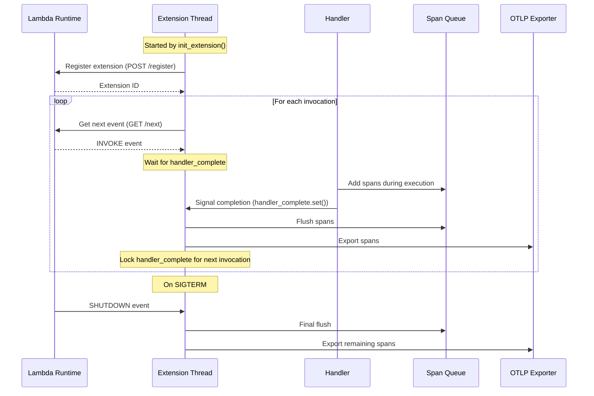

# Lambda OTel Lite

The `lambda-otel-lite` library provides a lightweight, efficient OpenTelemetry implementation specifically designed for AWS Lambda environments. It features a custom span processor and internal extension mechanism that optimizes telemetry collection for Lambda's unique execution model.

By leveraging Lambda's execution lifecycle and providing multiple processing modes, this library enables efficient telemetry collection with minimal impact on function latency. By default, it uses the [otlp-stdout-span-exporter](https://pypi.org/project/otlp-stdout-span-exporter) to export spans to stdout for the [serverless-otlp-forwarder](https://github.com/dev7a/serverless-otlp-forwarder) project.

>[!IMPORTANT]
>This package is highly experimental and should not be used in production. Contributions are welcome.

## Features

- Lambda-optimized span processor with queue-based buffering
- Three processing modes for different use cases:
  - Synchronous: Immediate span export (default, best for development)
  - Asynchronous: Background processing via internal extension
  - Finalize: Compatible with standard BatchSpanProcessor
- Internal extension thread for asynchronous mode
- Sigterm handler for asynchronous and finalize mode
- Automatic Lambda resource detection
- Automatic FAAS attributes from Lambda context and events
- Cold start detection and tracking
- Configurable through environment variables
- Optimized for cold start performance

## Dependencies

This package requires:
- Python 3.12 or later
- OpenTelemetry SDK
- otlp-stdout-span-exporter (included by default)

## Installation

We recommend using `uv` for faster and more reliable package installation:

```bash
uv pip install lambda-otel-lite
```

## Usage

### Basic Usage

```python
from lambda_otel_lite import init_telemetry, traced_handler
from opentelemetry.trace import SpanKind

tracer, provider = init_telemetry(name="my-service")

def handler(event, context):
    with traced_handler(
        tracer=tracer,
        tracer_provider=provider,
        name="my-handler",
        kind=SpanKind.SERVER,
        event=event,      # Optional: Enables automatic FAAS attributes for HTTP events
        context=context,  # Optional: Enables automatic FAAS attributes from context
    ):
        # Your handler code here
        process_event(event)
        return {"statusCode": 200}

def process_event(event):
    with tracer.start_as_current_span("process_event") as span:
        span.set_attribute("event.type", event.get("type"))
        # Process the event
```

### Automatic FAAS Attributes

The library automatically sets relevant FAAS attributes based on the Lambda context and event. Both `event` and `context` parameters must be passed to `traced_handler` to enable all automatic attributes:

- Resource Attributes (set at initialization):
  - `cloud.provider`: "aws"
  - `cloud.region`: from AWS_REGION
  - `faas.name`: from AWS_LAMBDA_FUNCTION_NAME
  - `faas.version`: from AWS_LAMBDA_FUNCTION_VERSION
  - `faas.instance`: from AWS_LAMBDA_LOG_STREAM_NAME
  - `faas.max_memory`: from AWS_LAMBDA_FUNCTION_MEMORY_SIZE
  - `service.name`: from OTEL_SERVICE_NAME (defaults to function name)
  - Additional attributes from OTEL_RESOURCE_ATTRIBUTES (URL-decoded)

- Span Attributes (set per invocation when passing context):
  - `faas.cold_start`: true on first invocation
  - `cloud.account.id`: extracted from context's invoked_function_arn
  - `faas.invocation_id`: from AWS_LAMBDA_REQUEST_ID
  - `cloud.resource_id`: from context's invoked_function_arn

- HTTP Attributes (set for API Gateway events):
  - `faas.trigger`: "http"
  - `http.status_code`: from handler response
  - `http.route`: from routeKey (v2) or resource (v1)
  - `http.method`: from requestContext (v2) or httpMethod (v1)
  - `http.target`: from path
  - `http.scheme`: from protocol

The library automatically detects API Gateway v1 and v2 events and sets the appropriate HTTP attributes. For HTTP responses, the status code is automatically extracted from the handler's response and set as `http.status_code`. For 5xx responses, the span status is set to ERROR.

Example with API Gateway:
```python
def handler(event, context):
    with traced_handler(tracer, provider, "api-handler", event, context):
        # HTTP attributes are automatically set based on event
        process_request(event)
        return {
            "statusCode": 200,  # Will be set as http.status_code
            "body": "Success"
        }

def error_handler(event, context):
    with traced_handler(tracer, provider, "api-handler", event, context):
        return {
            "statusCode": 500,  # Will set http.status_code and span status ERROR
            "body": "Internal error"
        }
```

- Event-based Attributes (set per invocation when passing event):
  - Additional attributes based on event type (API Gateway, SQS, etc.)

### Distributed Tracing

The library supports distributed tracing across service boundaries. Context propagation is handled automatically when you pass the `event` parameter and it contains a `headers` property. You can also provide a custom carrier extraction function for more complex scenarios:

```python
from opentelemetry.trace import SpanKind

def handler(event, context):
    # Context propagation is handled automatically if event has 'headers'
    with traced_handler(
        tracer=tracer,
        tracer_provider=provider,
        name="my-handler",
        kind=SpanKind.SERVER,
        event=event,  # Will automatically extract context from event['headers'] if present
        context=context,
        attributes={"custom.attribute": "value"}
    ):
        # Your handler code here
        return {"statusCode": 200}

# For custom carrier extraction:
def extract_from_sqs(event: dict) -> dict:
    """Extract carrier from SQS event."""
    # Extract tracing headers from the first record's message attributes
    if "Records" in event and event["Records"]:
        return event["Records"][0].get("messageAttributes", {})
    return {}

def handler_with_custom_extraction(event, context):
    with traced_handler(
        tracer=tracer,
        tracer_provider=provider,
        name="my-handler",
        kind=SpanKind.SERVER,
        event=event,
        context=context,
        get_carrier=extract_from_sqs  # Custom function to extract carrier from event
    ):
        # Your handler code here
        return {"statusCode": 200}
```

Please note that in a real world scenario, for SQS events you should probably use links instead.

The library provides:
- Automatic context extraction from `event['headers']` for HTTP/API Gateway events
- Custom carrier extraction through the `get_carrier` parameter
- Support for any event type through custom extraction functions
- Seamless integration with OpenTelemetry context propagation

This allows you to:
- Maintain trace context across Lambda invocations
- Track requests as they flow through your distributed system
- Connect traces across different services and functions
- Support custom event sources and propagation mechanisms
- Visualize complete request flows in your observability platform

### Custom Configuration

You can customize the telemetry setup by providing your own span processors:

```python
from opentelemetry.sdk.trace.export import BatchSpanProcessor, ConsoleSpanExporter

# Initialize with custom span processors
tracer, provider = init_telemetry(
    "my-lambda-function",
    span_processors=[
        BatchSpanProcessor(
            ConsoleSpanExporter()
        )
    ]
)

```

Or you can chain multiple processors:

```python
import psutil
from opentelemetry.sdk.trace import SpanProcessor
from opentelemetry.sdk.trace.export import BatchSpanProcessor, ConsoleSpanExporter

class MetricsProcessor(SpanProcessor):
    def on_start(self, span, parent_context=None):
        # Add metrics when span starts
        span.set_attribute("start_cpu_percent", psutil.cpu_percent(interval=None))

tracer, provider = init_telemetry(
    "my-lambda-function",
    span_processors=[
        MetricsProcessor(),  # First add metrics
        BatchSpanProcessor(  # Then export spans
            ConsoleSpanExporter()
        )
    ]
)
```

If no processors are provided, the library defaults to using a `LambdaSpanProcessor` with `OTLPStdoutSpanExporter` for integration with the serverless-otlp-forwarder.

## Processing Modes

The library supports three processing modes, controlled by the `LAMBDA_EXTENSION_SPAN_PROCESSOR_MODE` environment variable:

1. **Synchronous Mode** (`sync`, default)
   - Spans are exported immediately in the handler thread
   - Best for development and debugging
   - Highest latency but immediate span visibility
   - Does not install the internal extension thread and the sigterm handler

2. **Asynchronous Mode** (`async`)
   - Spans are queued and processed by the internal extension thread
   - Export occurs after handler completion
   - Best for production use
   - Minimal impact on handler latency
   - Installs the sigterm handler to flush remaining spans on termination

3. **Finalize Mode** (`finalize`)
   - Installs only the sigterm handler to flush remaining spans on termination
   - Typically used with the BatchSpanProcessor from the OpenTelemetry SDK for periodic flushes

### Async Mode Architecture

The async mode leverages Lambda's extension API to optimize perceived latency by deferring span export until after the response is sent to the user. Here's how it works:



The internal extension thread coordinates with the handler using a single threading.Event:
1. Extension thread starts in a waiting state (event is locked)
2. Handler executes and adds spans to the queue
3. When handler completes, it signals the extension (unlocks the event)
4. Extension processes spans and locks the event for the next invocation
5. On shutdown, any remaining spans are flushed and exported

This architecture ensures that span export doesn't impact the handler's response time while maintaining reliable telemetry delivery.

## Environment Variables

The library can be configured using the following environment variables:

- `LAMBDA_EXTENSION_SPAN_PROCESSOR_MODE`: Processing mode (`sync`, `async`, or `finalize`, defaults to `sync`)
- `LAMBDA_SPAN_PROCESSOR_QUEUE_SIZE`: Maximum number of spans to queue in the Lambda span processor (default: 2048)
- `OTEL_SERVICE_NAME`: Override the service name (defaults to function name)
- `OTEL_RESOURCE_ATTRIBUTES`: Additional resource attributes in key=value,key2=value2 format (URL-decoded values supported)
- `OTLP_STDOUT_SPAN_EXPORTER_COMPRESSION_LEVEL`: Gzip compression level for stdout exporter (0-9, default: 6)
  - 0: No compression
  - 1: Best speed
  - 6: Good balance between size and speed (default)
  - 9: Best compression

## Best Practices

1. **Initialization**
   - Initialize telemetry outside the handler
   - Use appropriate processing mode for your use case
   - Configure queue size based on span volume

2. **Handler Instrumentation**
   - Use `traced_handler` for automatic context management
   - Pass both event and context to enable all automatic FAAS attributes
   - Leverage automatic context propagation or provide custom extraction
   - Add relevant custom attributes to spans
   - Handle errors appropriately

3. **Resource Management**
   - Monitor queue size in high-volume scenarios
   - Use async mode for optimal performance
   - Consider memory constraints when configuring

4. **Error Handling**
   - Record exceptions in spans
   - Set appropriate span status
   - Use try/finally blocks for proper cleanup

5. **Cold Start Optimization**
   - Keep imports minimal
   - Initialize telemetry outside handler
   - Use async mode to minimize handler latency


## License

This project is licensed under the MIT License - see the [LICENSE](LICENSE) file for details. 