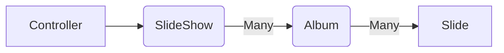

# Context
Normally runs continually on a dedicated computer.

# Class Relationship

(note: this is an experiment with markdown "mermaid")

```mermaid
graph LR
A[Controller] -->B(SlideShow)
B -->| Many |C(Album)
    C -->|Many| D[Slide]
```