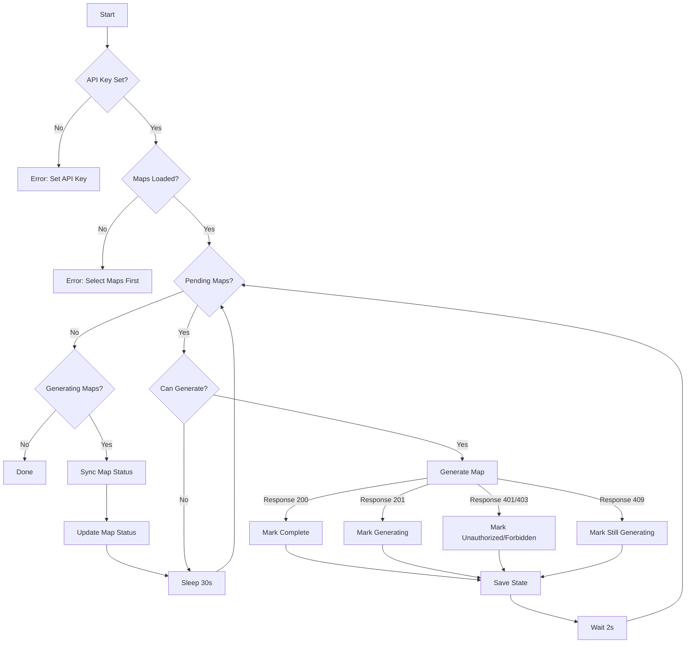

RustMaps Generator (Unofficial)
===


## Overview

This generator takes a CSV file (columns: seed, size, saved_config) and generates the corresponding map on rustmaps.com. It adheres to concurrent and monthly limits in addition to a 60 req/min rate limiter it enforces itself. When generation is triggered, it maintains a `sv.csv` file which keeps state in the event of a crash, unexpected reboot, etc.

We use this to generate our 52 custom procedural maps. Play them on [mainloot](https://discord.gg/mainloot)

| Feature                 | Supported | Notes                                      |
|-------------------------|-----------|--------------------------------------------|
| Profile                | ❌        | Not yet supported, planned for future updates. |
| Billing                | ❌        | Not yet supported, planned for future updates. |
| Custom Prefabs         | ❌        | Not yet supported, planned for future updates. |
| Servers Pages          | ❌        | Not yet supported, planned for future updates. |
| Custom Map Upload      | ❌        | Not yet supported, planned for future updates. |
| Map Generator          | ❌        | Not yet supported, planned for future updates. |
| Custom Map Generator   | ✅        | Fully supported with current tool capabilities. |


## Install from source

```sh
❯ git clone https://github.com/maintc/rustmaps-generator.git
❯ cd rustmaps-generator
❯ pip install .
# optional: if you're using pyenv
❯ pyenv rehash
```

## Command Line Usage

set your api key, find yours at https://rustmaps.com/dashboard
```
rustmaps login --api-key "<your-api-key>"
```

list imported map files (CSVs)
```
rustmaps list
```

create an empty csv
```
echo "seed,size,saved_config" > test.csv
```

importing maps with csv file
```
rustmaps import --maps-path ./test.csv
```
```
2025-01-15 15:31:19 - Imported map from /Users/user/Development/rustmaps-generator/test.csv to /Users/user/Library/Application Support/rustmaps-generator/maps/test.sv.csv
```

# see it in our list
❯ rustmaps list
Imported maps: (1)
  - test

# and try to generate maps from it
❯ rustmaps generate --maps-name test
2025-01-15 15:31:52 - Empty map file. Nothing to generate.

# this one's empty, let's destroy it
❯ rustmaps destroy --maps-name test
2025-01-15 15:42:20 - Map test removed.

# add a record specifying seed, size, and config name (yours will differ, update it. it's probably "default")
❯ echo "1986142550,4250,CombinedOutpost" >> test.csv

# import the map again
❯ rustmaps import --maps-path ./test.csv
2025-01-15 15:44:04 - Imported map from /Users/user/Development/rustmaps-generator/test.csv to /Users/user/Library/Application Support/rustmaps-generator/maps/test.sv.csv

# generate the map. this will track the progress
❯ rustmaps generate --maps-name test
2025-01-15 15:52:24 - Map 1986142550 has begun generating
2025-01-15 15:52:26 - Map 1986142550 is still generating
...

# you don't have to wait for generate to finish
# you can ctrl-c at any time
# or you can specify --once and come back to it
❯ rustmaps generate --maps-name test --once
2025-01-15 16:06:50 - Map 1986142550 is still generating

# 5 minutes later
❯ rustmaps generate --maps-name test --once
2025-01-15 16:11:50 - Map 1986142550 is still generating

# or you can leave it hanging
❯ rustmaps generate --maps-name test
2025-01-15 16:12:28 - Map 1986142550 is still generating
2025-01-15 16:12:59 - Map 1986142550 is still generating
2025-01-15 16:13:29 - Map 1986142550 has completed generation

# once complete, you can download them locally
❯ rustmaps download --maps-name test --version latest
2025-01-15 17:05:52 - Map 1986142550 has completed generation
2025-01-15 17:05:52 - Downloading map 1986142550 to /Users/user/Library/Caches/rustmaps-generator/test/latest/1986142550
2025-01-15 17:05:52 - Downloading map to /Users/user/Library/Caches/rustmaps-generator/test/latest/1986142550/1986142550_4250_CombinedOutpost_latest_map.map
2025-01-15 17:05:53 - Downloading image to /Users/user/Library/Caches/rustmaps-generator/test/latest/1986142550/1986142550_4250_CombinedOutpost_latest_image.png
2025-01-15 17:05:53 - Downloading image_with_icons to /Users/user/Library/Caches/rustmaps-generator/test/latest/1986142550/1986142550_4250_CombinedOutpost_latest_image_with_icons.png
2025-01-15 17:05:53 - Downloading thumbnail to /Users/user/Library/Caches/rustmaps-generator/test/latest/1986142550/1986142550_4250_CombinedOutpost_latest_thumbnail.png
2025-01-15 17:05:53 - Map 1986142550 downloaded successfully
```

## Where is stuff stored?

Windows:
```
Cache dir: C:\Users\<username>\AppData\Local\mainloot\rustmaps-generator\Cache
Config dir: C:\Users\<username>\AppData\Local\mainloot\rustmaps-generator
Data dir: C:\Users\<username>\AppData\Local\mainloot\rustmaps-generator\Data
Log dir: C:\Users\<username>\AppData\Local\mainloot\rustmaps-generator\Logs
```

macOS:
```
Cache dir: ~/Library/Caches/rustmaps-generator
Config dir: ~/Library/Application Support/rustmaps-generator
Data dir: ~/Library/Application Support/rustmaps-generator
Log dir: ~/Library/Logs/rustmaps-generator
```

Linux:
```
Cache dir: ~/.cache/rustmaps-generator
Config dir: ~/.config/rustmaps-generator
Data dir: ~/.local/share/rustmaps-generator
Log dir: ~/.local/state/rustmaps-generator/log (or ~/.cache/rustmaps-generator/log on older systems)
```

## Contributing

### Running tests

```sh
make test
```

### Al Gore



## TODO

- Fail on duplicate entries fast
- Be able to make changes to original csv, detect diffs
